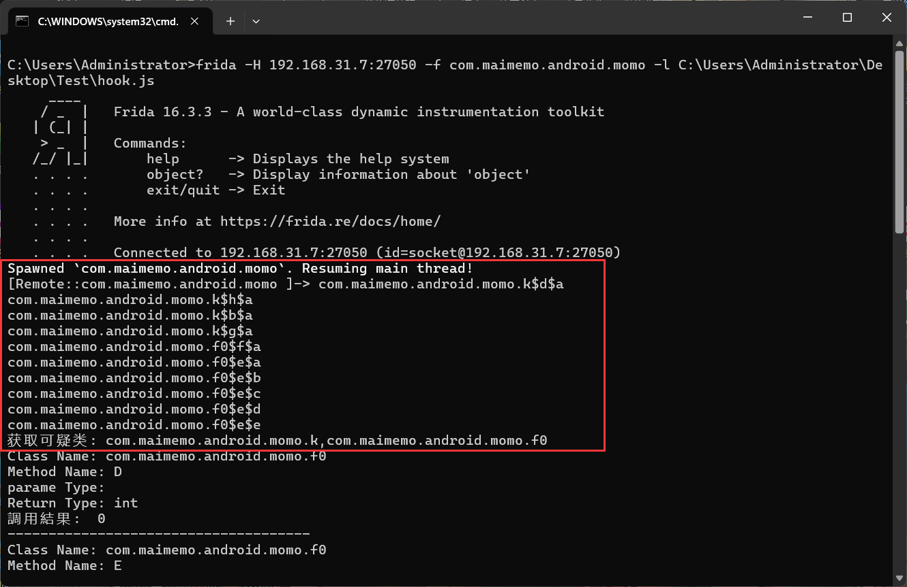
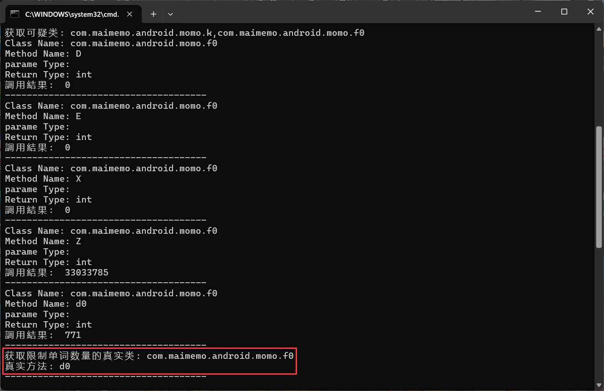
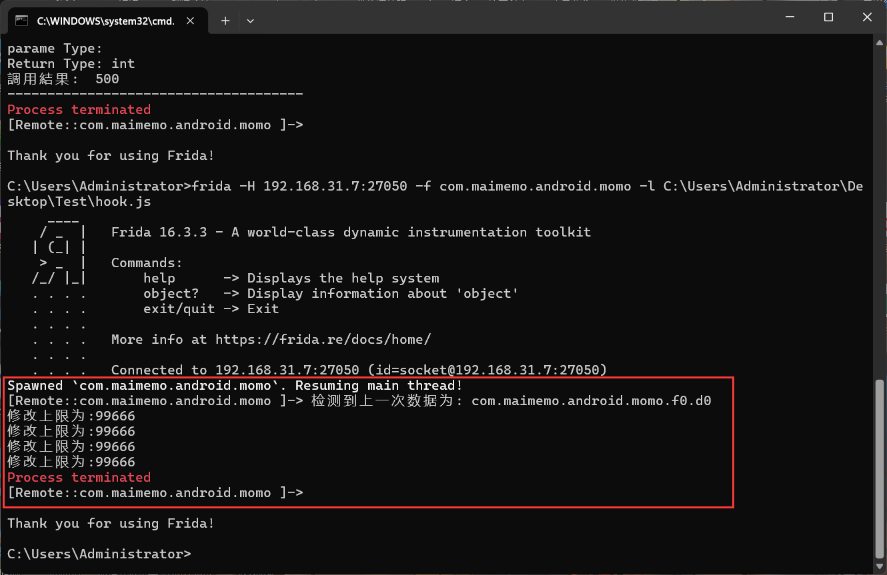

# 墨墨Xposed 

是一个 LSPosed 插件 

用于修改墨墨背单词的单词上限和解锁用户等级，自用

(仅支持lsposed 不支持任何免root框架)

通过检测目标函数的特征来自动找到 hook 点，理论适配全部版本

请注意：首次打开请在app中停留的时间久一点！！！

### 使用方式：

1. 安装插件，在相应框架内勾选墨墨背单词

2. 打开墨墨背单词 app，首次打开会自动寻找 hook 函数，并保存在本地

3. 弹出已找到 hook 函数的消息后，退出 app

4. 再次打开 app 即生效

 

测试通过环境：Redmik50pro A13 XposedAPI 100 arm64-v8a

---

原 app 存在加固和混淆，不易适配
遂手搓特征检测，通过正则表达过滤可疑类，参数为空和返回值类型为 int 过滤可疑函数，逐个调用对比，返回值在600-10000区间得到真实的 hook 目标。

 

